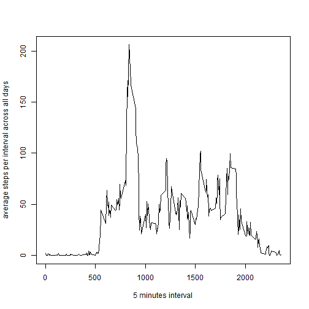

### Reproducible Research Peer Assessment Project 1
Catherine Li Feb 2015

#### Project Summary

This project intends to analyze data from a personal activity monitoring device to find patterns in people's exercise behavior. 

#### Loading and preprocessing the data

###### 1. Load the data

The dataset has a total of 17,568 observations. The variables included in this dataset are:
- steps: steps taking in a 5-minute interval (missing values are coded as NA)
- date: date on which the measurement was taken in YYYY-MM-DD format
- interval: Identifier for the 5-minute interval in which measurement was taken


```r
data<-read.csv("activity.csv", header=TRUE, sep=",")
head(data)
```

```
##   steps       date interval
## 1    NA 2012-10-01        0
## 2    NA 2012-10-01        5
## 3    NA 2012-10-01       10
## 4    NA 2012-10-01       15
## 5    NA 2012-10-01       20
## 6    NA 2012-10-01       25
```
 
###### 2. Process/transform the data (if necessary) into a format suitable for your analysis

Given the dataset is very simple, I did not find it necessary to transform variables. However, later on, per request, I transfored dates into weekday vs. weekend.

#### What is mean total number of steps taken per day?
For this part of the assignment, you can ignore the missing values in the dataset.

###### 1.Make a histogram of the total number of daily steps. 


```r
histData <- aggregate(steps ~ date, data = data, sum, na.action=na.omit)
hist(histData$steps, breaks=10, col="lightblue", labels=TRUE)
```

 

###### 2. Calculate and report the mean and median total number of steps taken per day


```r
options(digits=10)
summary(histData$steps)
```

```
##     Min.  1st Qu.   Median     Mean  3rd Qu.     Max. 
##    41.00  8841.00 10765.00 10766.19 13294.00 21194.00
```
From the result, we know the mean of total number of daily steps is 10766, and the median is 10765. Please note the missing values are ignored when performing analysis. 

### What is the average daily activity pattern?

###### 1. Make a time series plot (i.e. type = "l") of the 5-minute interval (x-axis) and the average number of steps taken, averaged across all days (y-axis). 


```r
intervalSteps<-aggregate(steps~interval, data=data, mean, na.action=na.omit)
plot(intervalSteps$interval, intervalSteps$steps, type="l", xlab="5 minutes interval",ylab="average steps per interval across all days")
```

 

###### 2. Which 5-minute interval, on average across all the days in the dataset, contains the maximum number of steps?


```r
intervalSteps[which(intervalSteps$steps==max(intervalSteps$steps)), ]
```

```
##     interval       steps
## 104      835 206.1698113
```

Interval 835 contains the maximum average steps (206 steps) across all the days.


### Imputing missing values.

Note that there are a number of days/intervals where there are missing values (coded as NA). The presence of missing days may introduce bias into some calculations or summaries of the data.

###### 1. Calculate and report the total number of missing values in the dataset (i.e. the total number of rows with NAs).


```r
table(complete.cases(data))
```

```
## 
## FALSE  TRUE 
##  2304 15264
```
We have 2304 rows with NAs. 

###### 2. Devise a strategy for filling in all of the missing values in the dataset. The strategy does not need to be sophisticated. For example, you could use the mean/median for that day, or the mean for that 5-minute interval etc.

I assume an individual's behavior pattern is sort of consistent from day to day. That is, if you are active on Monday morning, you are likely to be active as well on Tuesday morning. Though it is not a perfect assumption and cannot accomodate the complexities of real life. However, I believe it is a valid assumption. Therefore I use the mean for that 5 minutes interval to replace the missing values in the dataset.   


```r
library(plyr)
impute.mean <- function(x) replace(x, is.na(x), mean(x, na.rm = TRUE))
newData <- ddply(data, ~ interval, transform, steps = impute.mean(steps))
```

###### 3. Create a new dataset that is equal to the original dataset but with the missing data filled in.


```r
newData<-arrange(newData, date)
head(newData)
```

```
##           steps       date interval
## 1 1.71698113208 2012-10-01        0
## 2 0.33962264151 2012-10-01        5
## 3 0.13207547170 2012-10-01       10
## 4 0.15094339623 2012-10-01       15
## 5 0.07547169811 2012-10-01       20
## 6 2.09433962264 2012-10-01       25
```

```r
head(data)
```

```
##   steps       date interval
## 1    NA 2012-10-01        0
## 2    NA 2012-10-01        5
## 3    NA 2012-10-01       10
## 4    NA 2012-10-01       15
## 5    NA 2012-10-01       20
## 6    NA 2012-10-01       25
```
This dataset named "newData" is created in the last step, which is the same as the original dataset named "data"" with the missing data filled in. It is ordered by date. If you compare these two different datasets "newData" vs. "data", you can find the missing values have been filled. 

###### 4. Make a histogram of the total number of steps taken each day and calculate and report the mean and median total number of steps taken per day. Do these values differ from the estimates from the first part of the assignment? What is the impact of imputing missing data on the estimates of the total daily number of steps?


```r
histnewData <- aggregate(steps ~ date, data = newData, sum)
hist(histnewData$steps, breaks=10, col="lightblue", labels=TRUE)
```

 

```r
options(digits=10)
summary(histnewData$steps)
```

```
##     Min.  1st Qu.   Median     Mean  3rd Qu.     Max. 
##    41.00  9819.00 10766.19 10766.19 12811.00 21194.00
```
The mean of total number of steps taken each day is 10766, same as before. The median is 10766, pretty much the same as before (median for the data with the missing values=10765). Overall, neither mean nor median differ much from the estimates from the first part of the assignment. To elaborate, the mean is not affected, as the missing values are substituted by the mean measures. The impact on median is also neglibible. 

### Are there differences in activity patterns between weekdays and weekends?

For this part the weekdays() function may be of some help here. Use the dataset with the filled-in missing values for this part.

###### 1. Create a new factor variable in the dataset with two levels -- "weekday" and "weekend" indicating whether a given date is a weekday or weekend day.


```r
library(timeDate)
```

```
## Warning: package 'timeDate' was built under R version 3.1.2
```

```r
newData$weekday<-weekdays(as.Date(newData$date))
newData$weekday2<-isWeekday((as.Date(newData$date)), wday = 1:5)
newData$weekdayDummy<-factor(newData$weekday2,levels = c("TRUE","FALSE"),labels = c("weekday", "weekends"))
newData2<-newData[,c(1,2,3,6)]
head(newData2)
```

```
##           steps       date interval weekdayDummy
## 1 1.71698113208 2012-10-01        0      weekday
## 2 0.33962264151 2012-10-01        5      weekday
## 3 0.13207547170 2012-10-01       10      weekday
## 4 0.15094339623 2012-10-01       15      weekday
## 5 0.07547169811 2012-10-01       20      weekday
## 6 2.09433962264 2012-10-01       25      weekday
```

###### 2. Make a panel plot containing a time series plot (i.e. type = "l") of the 5-minute interval (x-axis) and the average number of steps taken, averaged across all weekday days or weekend days (y-axis). 


```r
intervalSteps2<-aggregate(steps~interval+weekdayDummy, data=newData2, mean)
library("lattice")
xyplot(intervalSteps2$steps~intervalSteps2$interval|intervalSteps2$weekdayDummy, layout=c(1,2), type="l")
```

 

